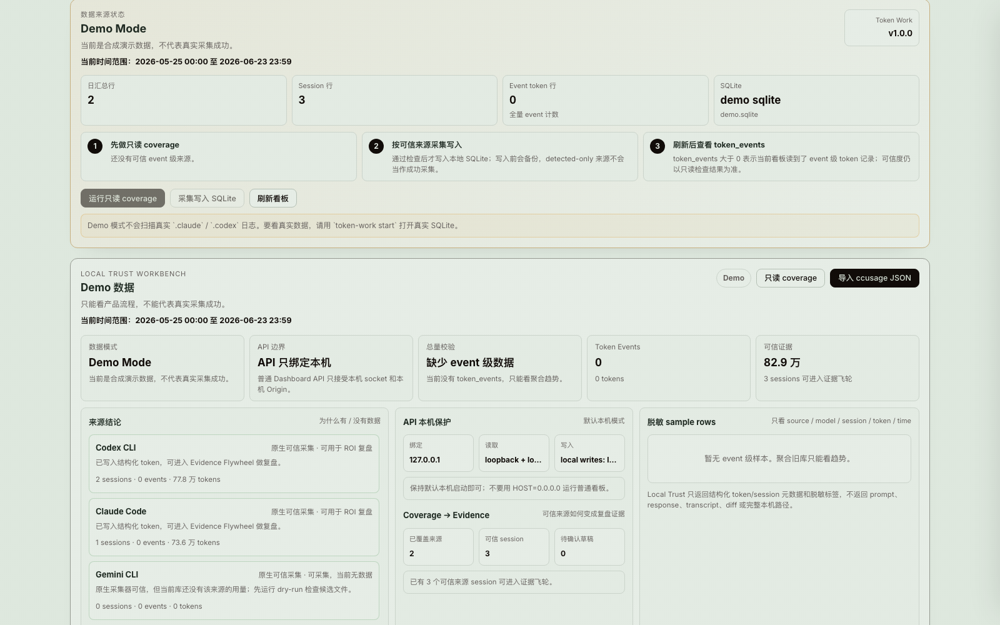
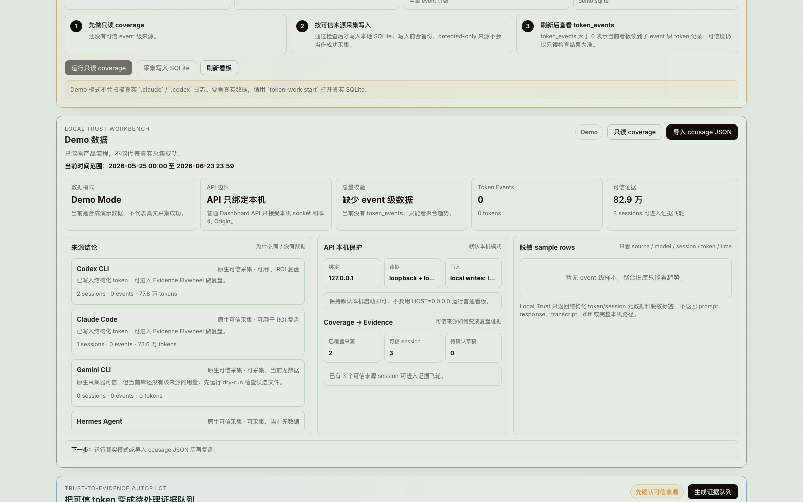
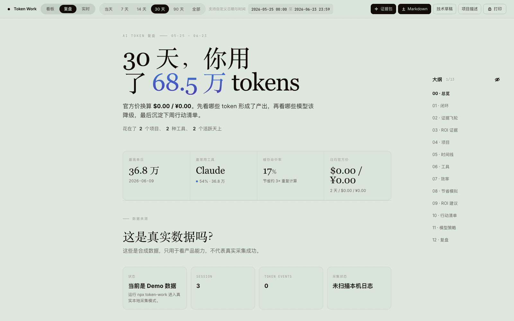
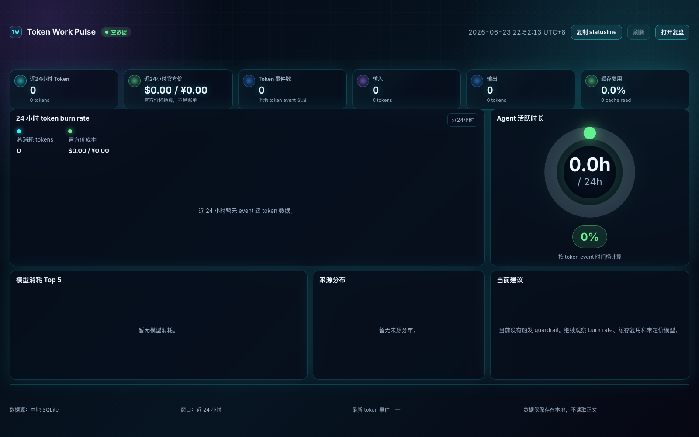

# Token Work ROI

[English](README.en.md) | **中文**

**Local AI Coding ROI Studio.** Token Work ROI 不只是 token meter，而是一个本地隐私优先的 AI 编程复盘工具：记录 token 和官方价换算成本，连接项目、任务、工作阶段、产出证据和模型策略。

```bash
npx token-work
```

默认命令会先做本机只读 coverage，再把 Claude/Codex 的可信 event 级 token 记录写入本地 SQLite，最后打开浏览器。`demo` 只用于合成演示数据。

首屏只需要记住三个差异：

- **Work Evidence**：回答 token 花在哪、对应什么项目/任务/阶段/产出。
- **Evidence Autopilot**：一键把真实 token 转成项目、任务、阶段、价值和产出证据草稿。
- **Savings Simulator**：按官方公开 token 价格模拟模型切换后的节省空间。

默认不读取、不展示、不上传对话正文；只读取结构化 token/model/time/session 元数据。

## Why Not ccusage / CodeBurn?

| 工具 | 强项 | Token Work ROI 的差异 |
|---|---|---|
| ccusage | 覆盖广、JSON 输出成熟 | Token Work ROI 用 ccusage bridge 补覆盖，但重点做产出和复盘 |
| CodeBurn | `npx` TUI 和本地成本观测 | Token Work ROI 做周报、行动闭环和模型策略 |
| TokenTracker / CodexBar | 桌面组件、限额可见性 | Token Work ROI 做本地 ROI 决策和工作证据 |
| tokscale | CLI/TUI、贡献图和 leaderboard | Token Work ROI 不追社交化展示，保留本地复盘闭环 |

更完整的竞品参考和差异化记录见 [docs/competitive-notes.md](docs/competitive-notes.md)。

当前本地最新版本为 `v1.0.0`。项目仍不追 leaderboard、云同步、账号、多用户或伪造 collector；终局验收见 [docs/final-review.md](docs/final-review.md)。

## What Makes ROI Different?

Token Work ROI 的重点不是再堆一个 token meter，而是把统计结果转成可执行复盘证据，并用 Coverage Catch-up + Evidence Flywheel 把“有没有数据、数据从哪来、能不能支撑 ROI 判断”讲清楚。可选 Desktop Pulse 复用本地 `/live`，发布前必须通过本地 gate、GitHub release gate、tarball smoke 和 npm post-publish smoke。

- **Coverage Catch-up Center**：把来源分成原生可信采集、ccusage 可导入、实验采集、仅检测到、不支持/无 token 字段，避免把目录检测误认为真实覆盖。
- **Coverage Bridge Workflow**：每个来源给出成功覆盖、失败原因、可导入 report 和 copy-only 命令；浏览器只生成命令，不运行外部扫描器。
- **Local Trust Workbench**：集中展示数据模式、coverage gate、daily/session/event 总量校验、来源失败原因和脱敏 sample rows，先判断“能不能强复盘”。
- **Evidence Flywheel**：在 `/review` 串起真实 token、项目识别、自动证据、待确认草稿、产出链接和模型策略样本，让 0 分页面变成可执行队列。
- **Trust-to-Evidence Autopilot**：在 Dashboard 和 `/trust` 把可信来源 session 转成最高价值 10 条证据队列，按官方价和 token 排序，区分可自动写入和待确认草稿。
- **Evidence Quality Loop**：把证据分为可直接写入、待确认草稿、不可写入和人工确认，Savings Simulator / Model Strategy 会标明证据来源。
- **Evidence Autopilot**：在 `/review` 一键生成复盘证据，自动补高置信归因、项目别名、产出链接候选和模型策略样本；不调用 LLM，不读取正文，不覆盖人工标注。
- **Git metadata output candidates**：只读取 repo 名、remote host、commit hash 和 commit 时间；只有能生成 HTTPS commit URL 时才写入产出链接，不读取 diff 或文件内容。
- **ROI Savings Simulator**：模拟“探索、测试、上下文整理、低价值或废弃任务从重模型切到轻量/中模型”时，按官方公开 token 价格可能少花多少。
- **ccusage JSON Import**：支持 ccusage documented JSON output，借它的多源生态导入结构化 token 数据，但成本仍由 Token Work 官方价函数重算。
- **ccusage CLI Bridge UX**：Dashboard 只生成可复制命令，不从浏览器运行外部扫描器；真实 bridge 仍由用户在本地终端显式执行。
- **ccusage 后处理**：ccusage JSON 写入后进入 `/trust`，展示新增来源、项目、模型、session 覆盖和证据缺口变化。
- **Source Health / Coverage Bridge**：显示 native stable、experimental、detected-only、ccusage import-bridge 的状态、最近用量、token 字段可信度、推荐导入方式和隐私边界，不输出完整本机路径。
- **Collection Coverage Gate**：真实采集前先跑 `token-work coverage`，确认 Claude/Codex 是否有 event 级历史、Cursor 是否只有 detected-only，避免把目录检测误认为采集成功。
- **Import / Budget Wizard**：在 Dashboard 里粘贴或上传 ccusage JSON，先 dry-run 看 shape、session/event 数、unsafe 字段和未定价模型，确认后才写 SQLite。
- **Quota Profiles v2**：支持 rolling/fixed 自定义限额窗口、reset anchor、warning threshold，在 `/live` 看到 burn projection、reset countdown 和 near/over/exceeded warnings。
- **Quota Profiles v3**：预算窗口可按 source 和 model group 过滤，支持 warning threshold 与 hard threshold；仍然只是用户自定义 guardrail，不是供应商套餐额度。
- **Desktop Pulse Companion**：可选 Electron tray/window 入口，复用本地 `/live`、`/trust`、`/review`；它不复制 collector，但会让本地服务按安全规则刷新 Claude/Codex 结构化 token 元数据，不上传数据。
- **Cyberpunk Live / Pulse UI**：赛博朋克风格用于浏览器 `/live` 和 Electron Desktop Pulse；Dashboard、Trust、Review 继续保持类似 Claude 的浅色复盘审计界面。
- **Statusline Guardrails**：`token-work statusline` 输出最近窗口 token、burn rate、cache、预算使用率、未定价模型提示和 open actions，适配终端 prompt、tmux 或 Claude Code statusline。
- **ROI Playbook Export**：`token-work policy` 导出 Markdown、Claude Code 或 AGENTS 风格模型使用策略片段，不自动修改项目文件。
- **Advisor Action Loop**：把 Savings Simulator / ROI Advisor 建议加入行动清单，标记完成或忽略，并写入 Markdown 周报。
- **Advisor Action Measurement**：对比同类任务/模型在行动前后的 token 和官方价趋势，用于复盘策略是否值得继续；不声称真实因果节省。
- **Review Report v3**：Markdown 周报加入 Local Trust、Coverage-to-Evidence、Action trend、GitHub README 项目描述和博客素材口径。
- **Final Review**：`docs/final-review.md` 固定项目边界、验收清单和停止规则，避免继续无止境低收益迭代。
- **Collector Audit**：先审计 experimental collector 是否真的有可靠 token 字段，再决定是否升级支持级别，不用估算值伪造用量。
- **Work Evidence**：把 session 连接到项目、任务、阶段、价值、产出链接和 work item，回答“token 换来了什么”。

所有 ROI 金额都写作“官方价换算 / 节省模拟”，不能当供应商账单或财务对账。

## Quick Start

需要 Node.js 24 或更高版本。项目使用 `node:sqlite`，Node 22.12 在 GitHub Actions 上不可用。

```bash
npx token-work
```

预期输出类似：

```text
[token-work] coverage claude,codex,cursor (read-only)
[token-work] collect applied: sessions +..., token_events +...
[token-work] UI  http://127.0.0.1:5173/
[token-work] API http://127.0.0.1:4173
```

常用命令：

```bash
npx token-work
npx token-work --no-collect
npx token-work --dry-run-only
npx token-work demo
npx token-work start
npx token-work coverage --sources=claude,codex,cursor --json
npx token-work collect --dry-run --sources=claude,codex,cursor --json
npx token-work collect --apply --yes --sources=claude,codex
npx token-work import-usage --format=ccusage-cli --report=session --dry-run --yes
npx token-work statusline --format=text
npx token-work collectors
npx token-work privacy-check
```

从源码运行：

```bash
git clone https://github.com/codelishang/token-work-roi.git
cd token-work-roi
npm install
node src/cli.mjs
npm run desktop
```

### 本地浏览器端 vs 桌面端

| 入口 | 适合谁 | 做什么 | 当前状态 |
|---|---|---|---|
| `npx token-work` / `node src/cli.mjs` | 绝大多数用户 | 启动前运行只读 coverage 和可信 Claude/Codex apply，启动后每 60 秒刷新可信 event 级 token 元数据，然后打开 Dashboard、Trust、Review、Live、Import、Report | 主入口 |
| `npx token-work demo` | 第一次看产品能力 | 只启动合成 demo，不代表真实采集成功 | 演示入口 |
| `npm run desktop` | 想要托盘/小窗实时提醒的本地用户 | 启动或复用本地服务，打开 Desktop Pulse 小窗和托盘菜单；新启动的本地服务会每 60 秒刷新可信 Claude/Codex token 元数据 | 可选 MVP |

桌面端的意义不是替代浏览器工作台。完整复盘、证据队列、导入和报告仍在浏览器端完成；Desktop Pulse 只解决“我不想一直开浏览器 tab，但想随时看今天 token 是否失控、预算是否接近阈值、有什么 open action”的场景。浏览器 `/live` 与 Desktop Pulse 使用同一套深色 Pulse 实时看板。Pulse 不是读进程内存，而是让本地服务把落盘日志刷新到 SQLite 后展示最近窗口，通常会有 5-60 秒延迟。当前 Desktop Pulse 还不是 npm 下载的一键桌面安装包，后续如果要给普通用户分发，应通过 GitHub Release 提供 portable exe，并单独跑 desktop smoke 和隐私检查。

`npx token-work` 会扫描本机 `.claude`、`.codex` 和 Cursor 的结构化 token 元数据；只会自动写入 Claude/Codex 的可信 event 级记录，Cursor 没有明确 token 字段时只显示 detected/no-token-fields。默认真实入口启动后会继续每 60 秒刷新 Claude/Codex 可信 event 级元数据，`TOKEN_WORK_LIVE_COLLECT_INTERVAL_SECONDS` 可调整但最小 30 秒。`start`、`--no-collect`、`--dry-run-only` 和 `demo` 不会后台刷新。默认 DB 路径是当前运行目录的 `data/usage.sqlite`；可用 `--db` 或 `DB_PATH` 指定位置。Dashboard 会显示“数据来源状态”：Demo Mode、Empty DB、Real DB - aggregate only、Real DB - event data needs coverage 或 Real DB - event verified。`event verified` 需要 token events 加上通过的 coverage gate 或可验证的 collect run。`ccusage-cli` bridge 会显式运行外部 ccusage 本地扫描器；Token Work 只接收结构化 JSON，拒绝 conversation-like 字段，并忽略第三方 cost 字段。

首次使用流程见 [docs/first-run.md](docs/first-run.md)。Dashboard 也会根据当前数据状态显示“首次使用”引导：无数据时提示 demo/import，有数据但无 action 时提示去 `/review`，有预算但无事件级 live 数据时解释 `/live` 的窗口口径。

## Screenshots

这些截图来自 demo mode 或脱敏合成数据，不包含真实本机日志。









真实本地验收截图只用于发布前核对，不作为默认公开首屏素材；截图允许包含模型名、项目别名和聚合 token 数，但不得包含 prompt、response、transcript、diff、完整本机路径或私有导出报告。

- [真实 Dashboard，含图表](docs/assets/token-work-real-dashboard.png)
- [真实 Local Trust](docs/assets/token-work-real-trust.png)
- [真实 Review](docs/assets/token-work-real-review.png)
- [真实 Live](docs/assets/token-work-real-live.png)

高级排错命令：

```bash
npx token-work coverage --sources=claude,codex,cursor --json
npx token-work collect --dry-run --sources=claude,codex,cursor
npx token-work collect --apply --yes --sources=claude,codex
npx token-work compare-ccusage --report=session --json --yes
```

`coverage` 和 `--dry-run` 都只输出候选文件数、可解析 token 记录数、跳过原因、历史时间范围以及 daily/session/event token 合计，不写 SQLite。`--apply` 写入前会备份 SQLite；如果 Claude/Codex 有可解析 token 记录但将写入的 `token_events` 为 0，或者 daily/session/event 总量差异超过 1%，会被 coverage gate 阻止。Cursor 只有本地 `state.vscdb` 里存在明确 token 字段时才写入用量，否则显示“检测到但无可靠 token 字段”，不估算造数。

Token Work 不能承诺恢复所有历史。它只能覆盖本机仍保留、且日志里有可靠 token 字段的历史；已被上游清理或从未记录 token 字段的数据无法复原。

## Core Features

- Collector registry：Claude Code、Codex CLI、Gemini CLI、OpenCode、OpenClaw、Hermes Agent 作为 stable 来源。
- Experimental sources：Cursor、GitHub Copilot CLI、Qwen Code、Kimi、Goose 仅在存在明确 token 字段时导入，不伪造 token 或费用。
- Official-price conversion：按官方公开 token 单价换算，未公开美元价的模型保持未定价。
- Work attribution：项目、任务类型、产出状态、工作目的、阶段、价值、备注。
- Output evidence：只保存 URL、标签和类型，不抓取链接内容。
- ROI Evidence Score：检查归因、产出、人工确认和 work item 是否足够支撑 ROI 判断。
- ROI Savings Simulator：按官方价模拟模型切换后的节省空间，不把未定价模型算作 $0。
- ROI Advisor：本地规则建议，不调用 LLM，不额外消耗 token。
- Advisor Action Loop：把建议加入行动清单、标为完成或忽略；只做趋势复盘，不声称因果节省。
- Model Policy / ROI Playbook：导出 Markdown、Claude Code 或 AGENTS 风格策略片段，把历史用量转成下周模型使用策略，不自动写文件。
- ccusage Import Bridge：`token-work import-usage --format=ccusage-json` 导入保存的结构化 JSON，`--format=ccusage-cli` 显式调用 ccusage CLI；两者都不保存正文，不采用第三方估算成本。
- Source Health Center：Dashboard 和 `/api/source-health` 展示来源支持级别、检测状态、最近导入/采集摘要和 token 字段可信度，不泄露完整本机路径。
- Local Trust Workbench：Dashboard 和 `/api/local-trust` 展示数据可信度、coverage gate、daily/session/event reconciliation、来源失败原因和脱敏 sample rows。
- Trust UX：`/trust` 专页集中展示数据可信度、API 本机边界、remote ingest 状态、Coverage Bridge 和来源失败原因，帮助先判断“能不能强复盘”。
- Collection Coverage Gate：`token-work coverage`、`GET /api/collection-coverage` 和 Dashboard “真实采集可信度”卡片展示历史范围、event/session/daily 一致性、未覆盖来源和失败原因。
- Import / Budget Wizard：Dashboard 内置 ccusage JSON dry-run/apply、ccusage CLI Bridge 命令生成器和预算窗口创建入口。
- Quota Profiles v2：自定义 source 级 token/cost 预算窗口，支持 rolling/fixed、reset anchor 和 warning threshold，`/live` 显示 near/over/exceeded warnings。
- Live Monitor：`/live` 轻量监控最近 15 分钟 token、模型、cache、burn rate、预算窗口和 guardrail warnings。
- Statusline Guardrails：`token-work statusline --format=text|json` 只读 SQLite，输出最近窗口 token、burn rate、cache、预算使用率、reset countdown、未定价模型提示和 open Advisor Actions；集成示例见 [docs/statusline.md](docs/statusline.md)。
- Collector Audit：`token-work collectors --audit` 只输出实验来源安全摘要，不写 SQLite。
- Terminal Report：`token-work report --period=week --format=table|markdown|json` 快速查看 ROI 复盘摘要。
- Privacy check：公开前扫描真实 DB、AI 日志目录、`.env`、导出文件和个人路径。
- Demo mode：公开演示默认使用合成数据并显示 Demo Mode 标识。
- First-run onboarding：空数据、导入、预算、复盘 action 的首次使用引导，不新增云同步或账号。

## Why Not Just ccusage / CodeBurn?

ccusage、CodeBurn、TokenTracker 和 token-dashboard 更偏 token meter、TUI、实时 burn rate 或工具覆盖。Token Work ROI 的核心不是替代这些统计器，而是把本地 token 消耗变成可复盘的工作证据：项目、任务、目的、阶段、价值、产出链接、work item、ROI Evidence、Advisor 行动项和 Model Policy。

如果你只想知道今天用了多少 token，ccusage 或 CodeBurn 会更轻。如果你想知道这些 token 换来了什么产出、下周该怎么换模型策略，Token Work ROI 更适合。

## Privacy Boundary

Token Work ROI 不保存：

- prompt
- response
- full transcript
- full file path
- command body
- diff content

细粒度分析只允许保存 token 结构、来源、模型、时间、tool category、文件扩展名、repo path hash 和 privacy level。

运行公开检查：

```bash
npm run privacy:check
```

## 官方价格与汇率

Token Work 只把费用显示为“官方公开单价换算”，不是供应商账单。美元官方价直接按 USD / 1M tokens 计算；人民币官方价会保留来源货币信息，并在刷新时按 USD/CNY 汇率换算成内部美元成本，同时在界面展示人民币参考值。

模型价格由 `npm run pricing:update` 从 provider-owned 价格页刷新，成功后写入 [data/official-pricing.json](data/official-pricing.json) 并同步更新 [src/pricing.mjs](src/pricing.mjs) 的内置表。GitHub Actions 的 [update-pricing](.github/workflows/update-pricing.yml) 每周一 00:01（Asia/Shanghai）运行；如果所有官方来源都抓取失败，脚本会失败并保持现有缓存和内置表不变。未能确认官方价的模型继续显示为未定价，不按 `$0` 参与成本判断。

## API

稳定接口：

- `GET /api/data`
- `GET /api/collectors`
- `GET /api/source-health`
- `GET /api/live`
- `GET /api/budget-profiles`
- `POST /api/budget-profiles`
- `DELETE /api/budget-profiles`
- `POST /api/import/ccusage-json`
- `GET /api/advisor-actions`
- `POST /api/advisor-actions`
- `DELETE /api/advisor-actions/:id`
- `GET /api/privacy-check`
- `GET /api/model-policy.md`
- `POST /api/collect`
- `POST /api/session-annotations`
- `POST /api/session-annotations/batch`
- `POST /api/session-outputs`
- `GET /api/auto-attribution/suggestions`
- `POST /api/auto-attribution/apply`
- `POST /api/auto-attribution/undo`
- `POST /api/work-items`
- `POST /api/work-items/link-sessions`
- `DELETE /api/work-items/:id`

所有非 public 的 `/api/*` 读接口也限制为 loopback + local Origin；普通写接口继续限制为 loopback、local Origin、JSON。`/api/ingest` 默认关闭，只有显式设置 `INGEST_TOKEN` 后才接受 `Authorization: Bearer <token>` 的 JSON 机器写入请求。服务端不信任 `X-Forwarded-For` 作为本机判断。服务默认只绑定 `127.0.0.1`；`HOST=0.0.0.0` 或其他非 loopback 绑定会被拒绝，除非显式设置 `TOKEN_WORK_ALLOW_REMOTE=1` 且提供 `INGEST_TOKEN`。这个远程模式只保留 ingest 场景，不会把普通 Dashboard API 开放成远程访问。

## Development

```bash
npm install
npm test
npm run build
npm run privacy:check
```

开发模式：

```bash
npm run dev
```

默认地址：

- UI: `http://127.0.0.1:5173`
- API: `http://127.0.0.1:4173`

## Public Readiness Checklist

- [ ] `npm test`
- [ ] `npm run build`
- [ ] `npm run privacy:check`
- [ ] `npm run pricing:update`
- [ ] `node src/cli.mjs privacy-check --include-untracked`
- [ ] `node src/cli.mjs coverage --sources=claude,codex,cursor --json`
- [ ] `npm run smoke:npx`
- [ ] `npm run smoke:browser`
- [ ] `npm run desktop:smoke`
- [ ] `npm audit --audit-level=low`
- [ ] `npm view token-work version` is lower than this package version before publishing
- [ ] `npm pack --dry-run`
- [ ] `npm run smoke:published -- --version 1.0.0` after npm publish
- [ ] demo screenshots come from demo mode
- [ ] real validation screenshots are inspected and contain no transcript, diff, prompt, full path, or private export
- [ ] `/live` loads from demo mode or temporary SQLite
- [ ] Desktop Pulse uses only local `127.0.0.1` URLs and passes Electron security smoke
- [ ] no real `data/usage.sqlite`
- [ ] no `.claude/`, `.codex/`, `.env`
- [ ] no raw conversation content
- [ ] README explains official-price conversion is not a provider invoice
- [ ] `data/official-pricing.json` and `src/pricing.mjs` agree on the latest successful pricing refresh

## License / Attribution

GNU Affero General Public License v3.0 only. Commercial dual licensing is available for organizations that need closed-source distribution, proprietary hosted services, or private modifications outside AGPL obligations. See [LICENSE](LICENSE), [COMMERCIAL-LICENSE.md](COMMERCIAL-LICENSE.md), and [NOTICE.md](NOTICE.md).
