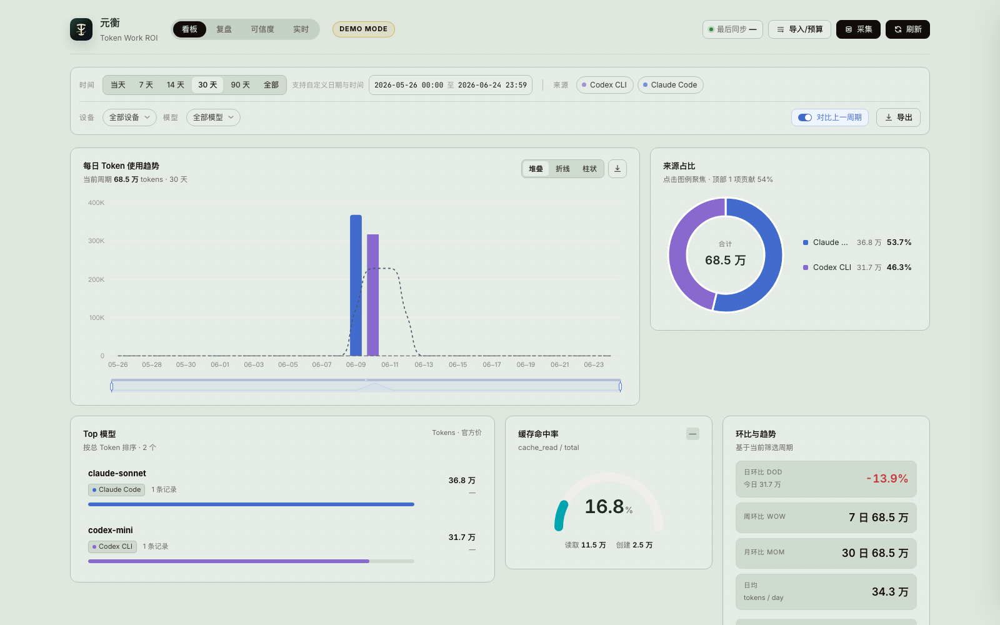
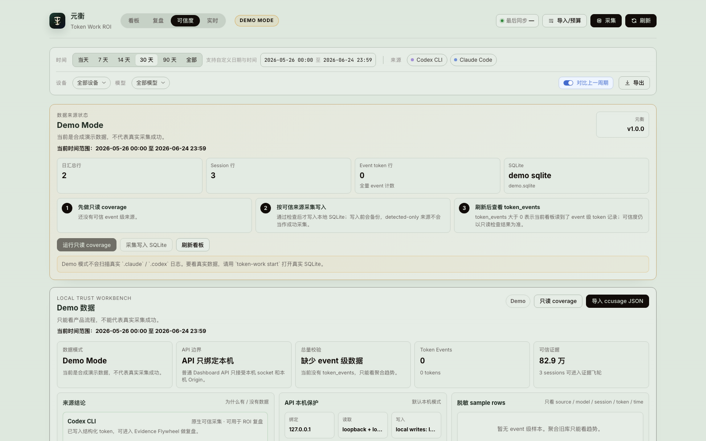
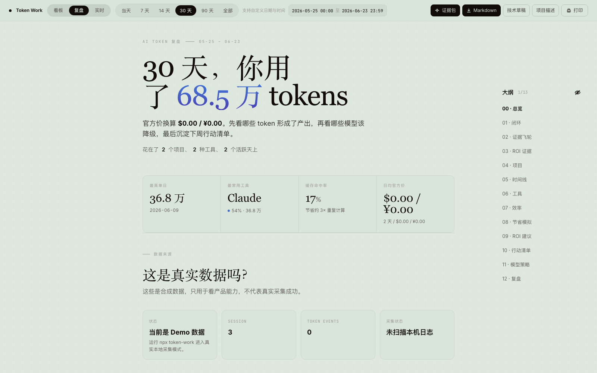
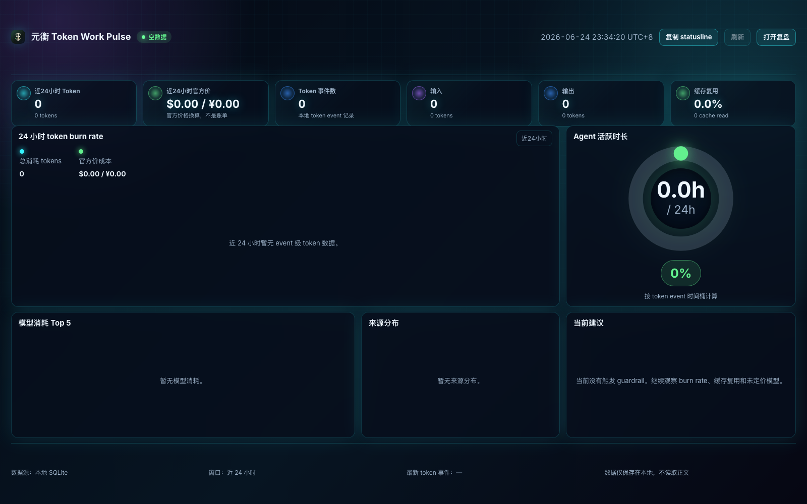

<p align="center">
  
</p>

<h1 align="center">元衡</h1>

<p align="center">
  <strong>把 AI 编程用量、成本与产出放到同一把尺上</strong><br>
  本机运行的词元用量与投入产出复盘工具
</p>

<p align="center">
  <a href="https://www.npmjs.com/package/token-work"></a>
  
  
</p>

<p align="center">
  <strong>简体中文</strong> · <a href="README.en.md">English</a> ·
  <a href="docs/first-run.md">首次使用</a>
</p>

---

## 元衡是什么

元衡（Token Work ROI）用于整理本机 AI 编程工具产生的结构化用量记录。它可以回答三个实际问题：

1. 最近用了多少 token，按官方公开单价估算是多少钱。
2. 用量主要来自哪些工具、模型和项目。
3. 这些消耗对应了什么任务和产出，下次是否需要调整模型选择。

数据保存在本机 SQLite 中。采集器不保存 prompt、response、完整对话、diff 或命令正文，元衡也不代替模型服务商账单。部分采集器会在本地保存 workspace/project path 用于项目归因；默认不会上传这些路径，公开截图、导出或启用远程推送前仍应检查并脱敏。

## 功能

| 功能 | 说明 |
|---|---|
| 看板 | 按时间、来源、模型和项目查看 token 与官方价成本 |
| 可信度 | 区分真实事件、聚合数据、仅检测到的来源和缺少 token 字段的来源 |
| 复盘 | 给 session 补充项目、任务、阶段、价值和产出，导出 Markdown 报告 |
| 实时 | 查看近 24 小时 burn rate、活跃 session、来源分布和预算提醒 |
| 数据导入 | 预检并导入 ccusage JSON 或其他兼容的结构化 JSON |
| 预算 | 按来源、模型组或固定时间窗口设置本地提醒 |
| 终端状态栏 | 在 shell、tmux 或 Claude Code 状态栏中显示简短用量摘要 |

## 快速开始

需要 Node.js 24.0.0 或更高版本。

```bash
npx token-work
```

默认入口会先打开浏览器页面，再每 5 分钟在后台采集 Claude Code、Codex、WorkBuddy 和 CodeBuddy 的可信事件级记录。Codex 会根据客户端元数据标为 Codex CLI、Codex Desktop 或 Codex；WorkBuddy 的 `auto` 模式只在本机 trace 或 session 元数据能确定唯一实际模型时写入。CodeBuddy 只将同一 BaseAgent 的模型初始化记录关联到随后的一个完成用量；没有对应记录时才标为 `unknown`，不猜测成本。采集通过可信门槛后，元衡会更新本地 SQLite。
普通定时写入最多每 24 小时创建一份完整备份；数据修复前会单独备份。新的受管备份创建成功后只保留最新一份，避免高频写盘和长期堆积。

首次使用只想看界面，可以选择以下方式：

```bash
npx token-work demo           # 使用合成演示数据
npx token-work --dry-run-only # 禁用定时采集，不写入采集结果
npx token-work --no-collect   # 不扫描本机 AI 工具记录
```

源码目录使用本地入口，不要用 `npx token-work` 代替当前源码：

```bash
git clone https://github.com/coderlishang/token-work-roi.git
cd token-work-roi
npm install
node src/cli.ts
```

第一次打开建议依次查看：**可信度 -> 看板 -> 复盘**。

## 界面

截图使用合成或脱敏数据，不包含真实本机日志。









## 数据来源

| 类型 | 来源 |
|---|---|
| 稳定采集 | Claude Code、Codex（CLI、Desktop 或未识别客户端）、Gemini CLI、OpenCode、OpenClaw、Hermes Agent、WorkBuddy、CodeBuddy |
| 实验采集 | Cursor、GitHub Copilot CLI、Qwen Code、Kimi、Goose |
| 外部导入 | ccusage JSON、ccusage CLI 以及兼容的结构化 JSON |

只有存在明确 token 字段的记录才会写入。元衡不会按文本长度猜测 token，也不会把“检测到目录”当成“采集成功”。完整状态见[数据来源支持表](docs/collector-support-matrix.md)。

## 导入另一台电脑的数据

先预检文件：

```bash
npx token-work import-usage --format=ccusage-json --file ccusage.json --device other-computer --dry-run
```

确认来源、日期和 token 数量无误后再写入：

```bash
npx token-work import-usage --format=ccusage-json --file ccusage.json --device other-computer --apply --yes
```

`--device` 用于区分不同电脑，同一台电脑应始终使用相同名称。一个设备和来源只使用一种 ccusage 报告格式，建议使用 `session`；混用 `daily`、`session` 等汇总视图可能重复统计，软件会拒绝写入。导入时忽略外部文件中的成本字段，统一按元衡的官方价格表重新计算。包含对话正文、prompt 或 response 的数据会被拒绝。

## 桌面小窗

桌面小窗是源码仓库中的可选入口，不是签名安装包：

```bash
npm install
npm run desktop:install
npm run desktop
```

它复用同一套本地服务，适合常驻查看实时页面。导入、标注和报告导出仍建议在浏览器中完成。详见[桌面版说明](desktop/README.md)。

## 价格与汇率

- 模型费用按官方公开的 token 单价换算，不是服务商账单。
- 人民币金额使用价格缓存中的 USD/CNY 汇率，仅作参考。
- 官方价格或汇率刷新失败时保留上一次成功缓存。
- GLM-5V-Turbo 与 Hy3 已按官方价格缓存计费；GLM-5V-Turbo 当前短上下文费率为输入 5 元、缓存命中 1.2 元、输出 22 元，Hy3 为输入 1 元、缓存命中 0.25 元、输出 4 元/百万 tokens。
- 未确认官方价格的模型显示为“未定价”，不会按 0 元处理。

维护者可以手动刷新缓存：

```bash
npm run pricing:update
```

仓库工作流每周二 01:15（Asia/Shanghai）尝试更新价格和汇率。

## 隐私

元衡默认不上传用量数据，不提供云同步，也不包含遥测。允许保存的内容限于复盘所需的结构化字段，例如时间、来源、模型、token 数量、session、设备、workspace/project path、项目别名、任务标签、预算和用户填写的产出链接。

发布或分享仓库前运行：

```bash
npm run privacy:check
```

详细边界见 [PRIVACY.md](PRIVACY.md)。

## 技术栈

Node.js 24 · TypeScript · React 18 · Vite · ECharts · SQLite · Electron

## 开发

```bash
npm install
npm test
npm run typecheck:tools
npm run build
npm run privacy:check
```

发布前还应运行 `npm run smoke:npx`、`npm run smoke:browser` 和 `npm run desktop:smoke`。完整流程见[发布检查表](docs/public-launch-checklist.md)。

## 文档

| 文档 | 内容 |
|---|---|
| [首次使用](docs/first-run.md) | 从启动到第一次复盘的操作顺序 |
| [数据来源支持表](docs/collector-support-matrix.md) | 各来源的检测、采集和默认写入状态 |
| [本地采集说明](docs/local-collectors.md) | 采集命令、可信门槛和环境变量 |
| [终端状态栏](docs/statusline.md) | shell、tmux 与 Claude Code 配置 |
| [品牌说明](docs/brand.md) | 名称、Logo 含义和使用规范 |
| [隐私说明](PRIVACY.md) | 本地数据、接口和远程 ingest 边界 |

## 名称与许可

“元”指词元、成本和原始记录；“衡”指衡量、校准和取舍。Logo 为本项目独立绘制，设计说明见[品牌说明](docs/brand.md)。

AGPL-3.0-only 协议，版权所有 © 2026 coderlishang，All rights reserved. 商业双授权说明见 [COMMERCIAL-LICENSE.md](COMMERCIAL-LICENSE.md)。
